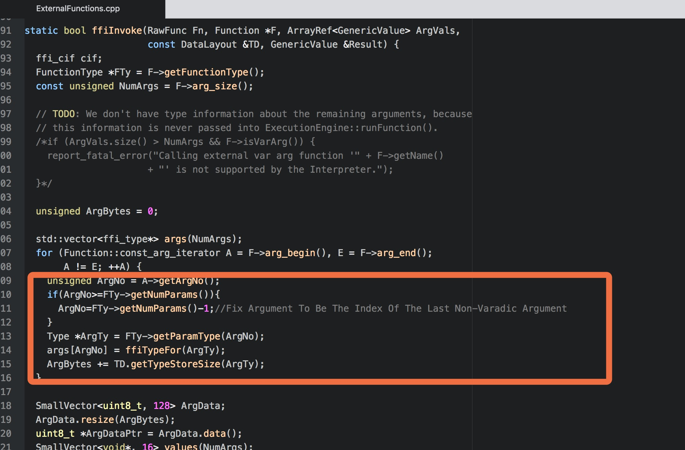
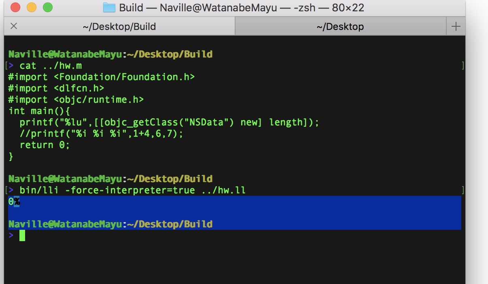

# LLHP
## An experimental WIP LLVM-ExecutionEngine Based Hot Patch Library
[Blog](http://mayuyu.io/2017/07/12/Exploring-LLVM-ExecutionEngine/)
## TODO:  
  - <del>IR Parsing</del>
  - Build type-encode:length table at compile time and get rid of current switch mess
  - Add Bridging Value Converting Function Registeration Mechanism
  - High Level Wrapper
  - Dual-way GV Emit/Update
  - Handle other aspects of an ObjC class
## POCs:

